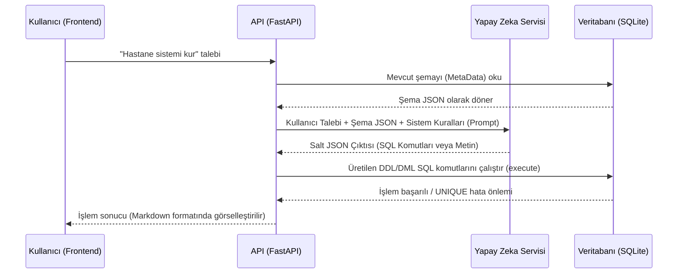

<div align="center">


# 🧠 DBCoors : Yapay Zeka Tabanlı Veritabanı Mimarı

**Sohbet Arayüzü Üzerinden SQL Şemaları Çizen ve Sentetik Veri Dolduran Otonom Sistem**


<p align="center">
  
  
  
  
  
  
</p>

</div>


<br>

## 📜 Proje Tanımı ve Amacı

**DBCoors**, karmaşık SQL veritabanlarını oluşturmayı ve yönetmeyi metin tabanlı bir sohbet asistanına indirgeyen bir arka plan (backend) sistemidir. Proje tamamen mevcut kod tabanına dayalı olarak şu üç temel işlevi yerine getirir:

1. **SQL Şeması Tasarımı:** Doğal dil analizleriyle `CREATE TABLE` sorguları üretir.
2. **Otomatik Test Verisi (Mock Data):** Python `Faker` kütüphanesini kullanarak, var olan tabloların kolon veri tiplerini (INT, VARCHAR, DATE vb.) ve ilişkilerini (Foreign Key) okur, buna uygun sentetik veri üretip `INSERT` eder.
3. **Anomali ve İlişki Analizi:** Tablolardaki mevcut verileri inceleyip olası mantık hatalarını veya gizli ilişkileri keşfeder.

<br>


## 🧩 Teknik Mimari ve Yetenekler

Mevcut kod altyapısının doğrudan desteklediği ve aktif olarak çalışan teknik yetenekler aşağıda listelenmiştir:

| Özellik | Açıklama (Kod Analizi) |
| :--- | :--- |
| **Çoklu AI Motoru** | `yz_servisi.py` içerisinde hem **Google Gemini** (1.5-flash) hem de **Alibaba Qwen** (qwen-plus) entegrasyonu mevcuttur. Parametrelerle dinamik değiştirilebilir. |
| **Yabancı Anahtar (FK) Zekası** | `vt_servisi.py` içerisindeki veri üretim algoritması, alt tablolar için rastgele numara uydurmak yerine, *Parent* (Ana) tabloları `SELECT` sorgusuyla tarayıp geçerli ID'leri yakalar. |
| **DML Çakışma Önleyici** | Üretilen `INSERT INTO` sorguları düzenli ifadelerle (regex) yakalanarak anında `INSERT OR IGNORE INTO` yapısına çevrilir (`UNIQUE constraint` çökmelerini önlemek için). |
| **Markdown Yanıt Formatı** | Frontend arayüzünde (`uygulama.js`), AI tarafından dönülen kodlar ve açıklamalar **marked.js** kütüphanesi yardımıyla renklendirilmiş (syntax-highlighted) bloklar halinde sunulur. |
| **SQLAlchemy Dinamik Bağlantı** | Sistem bir ORM tabanı kullanır. MetaData reflection (şema yansıması) ile mevcut veritabanını tarar ve saniyeler içinde JSON formatında AI'a aktarır. |

<br>


## 🔄 Sistem Akışı (Sequence Flow)

Aşağıdaki şema, sistemde gerçekleşen bir veri üretim veya tablo oluşturma döngüsünü göstermektedir:



<br>


## 🚀 Kurulum ve Çalıştırma

Projenin hiçbir ekstra bağımlılığı yoktur, sadece `requirements.txt` mantığında aşağıdaki paketlerin kurulu olması yeterlidir.

### Gereksinimlerin Yüklenmesi
```bash
pip install fastapi uvicorn sqlalchemy faker markdown google-genai requests openai
```

### Uygulamanın Başlatılması
Proje kök dizininde aşağıdaki komutu çalıştırarak yerel sunucuyu aktif edin:
```bash
python -m uvicorn ana:uygulama --port 8000 --reload
```

Sunucu `127.0.0.1:8000` adresinde başlayacaktır. Tarayıcınızdan bu adrese girerek sisteme erişebilirsiniz.

<br>


## 💻 Kullanım Örnekleri

Sohbet asistanına gönderebileceğiniz bazı doğrudan komut örnekleri:

> - *"Sisteme 'kitaplar' adında bir tablo ekle. id (primary), isim ve yazar kolonları olsun."*
> - *"Bu tablo için içine 50 adet sahte kitap verisi üret."*
> - *"Veritabanımdaki tablolar arasında nasıl bir gizli ilişki var, benim için analiz et."*
> - *"Kullanıcılar tablosunu sil."*

Tüm işlemler arka planda SQLite tabanında (veya verdiğiniz bağlantı metnine göre MySQL) fiziksel olarak saniyeler içinde gerçekleştirilecektir.

<br>


<div align="center">
  <p><b>DBCoors</b> - %100 Otonom Veritabanı Mühendisliği</p>
  <i>Yalnızca temiz kod, sıfır abartı.</i>
</div>
